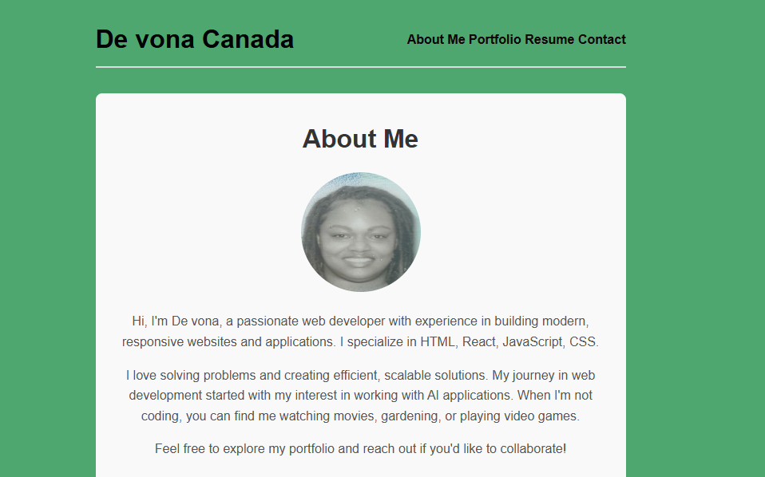

# React-Portfolio
# React Portfolio
  
  ## Description
  Portfolio deployed as a website on Netlify
  ## Table of Contents
  - [Installation](#installation)
  - [Usage](#usage)
  - [Contribution](#contribution)
  - [Test](#test)
  - [License](#license)
  - [Questions](#questions)
  ## Installation
  You can download previews and a copy of this code on Netlify. You can also download the code using Github.
  ## Usage
  Click on the links to read about me and my past job history. You can also submit your information if you would like to contact me. I have links to my Github, Linkden, and Stckflow.
  ## Contribution
  na
  ## Test
  na
  ## License
  MIT License
  ## Questions
  - [GitHub](Tivona)
  - Email: devonacanada@gmail.com
  - [Link]( https://github.com/TivonaDe/React-Portfolio/blob/main/02-Challenge/README.md)  

